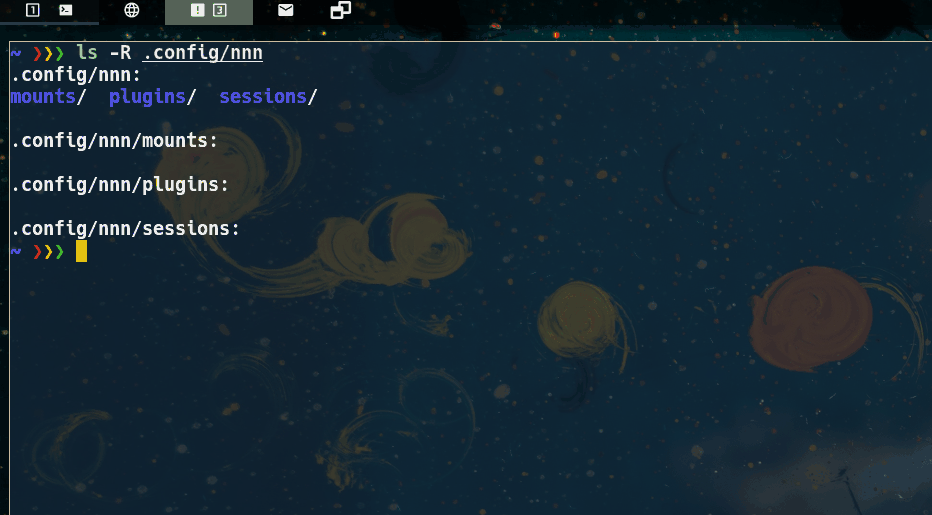

# almod

**Bash** script that helps you configure Alacritty terminal on GNU/Linux distros.
It is strongly recommended to use the **-b** option before you use any other option or make a backup manually of your config file. You can use **-r** to restore it.

You can increase/decrase opacity and text size, download themes from [this](https://github.com/eendroroy/alacritty-theme/tree/master/themes) repo and then set a random theme or choose the one you like the most with dmenu, you can also change the font with dmenu.

Use -h option for more details.
